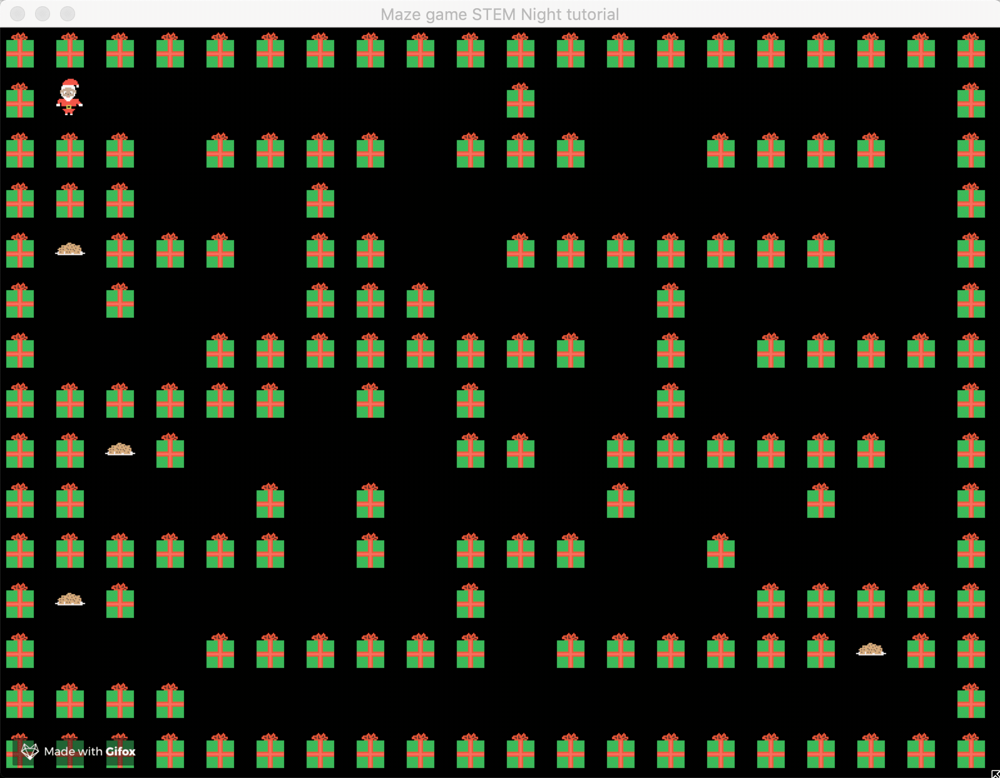

# STEMNight_MazeTutorial

A maze game to introduce elementary students to Computer Science using game development using Pygame and Makey Makey.
Starter code will be provided for initial game and player set up. The rest (i.e. player movement and sprite creation) will be up to the student to play around with.

